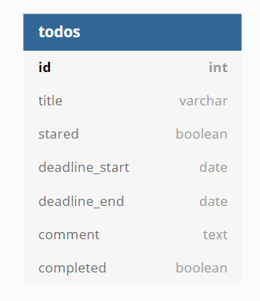

# Todolist server

## Setup

Create .env file:  

```ini
SYSTEM_IP=0.0.0.0
SYSTEM_PORT=5000
SYSTEM_AUTH_KEY=secret key
DB_HOST=db
DB_PORT=5432
DB_USER=postgres
DB_PASSWORD=password
DB_NAME=todo_database
```

## Run

```shell
# run
$ go run main.go middleware.go route.go

#build
$ go build
```

## Table schema

  

```sql
CREATE TABLE todos(
    id serial PRIMARY KEY,
    title VARCHAR (80) NOT NULL,
    stared Boolean NOT NULL,
    deadline_start DATE,
    deadline_end DATE,
    comment TEXT,
    completed Boolean NOT NULL
);

CREATE TABLE todo_sort(
    todo_id int UNIQUE NOT NULL REFERENCES todos(id) ON DELETE CASCADE,
    sort_index int UNIQUE NOT NULL
);

CREATE TABLE todo_user(
    id serial PRIMARY KEY,
    username VARCHAR (80) NOT NULL,
    password VARCHAR (80) NOT NULL
);
```

## Docker

Modify the host value to test_postgres which section is Database on env.ini file.  

```shell
# db
$ docker run --name test_postgres -e POSTGRES_PASSWORD=password -p 5432:5432 -d postgres

# build and run
$ docker build -t go-todolist-server .
$ docker run --name go-todolist-server -p 5000:5000 --link test_postgres:test_postgres -e SYSTEM_IP=0.0.0.0 -e SYSTEM_PORT=5000 -e SYSTEM_AUTH_KEY=secretkey -e DB_HOST=db -e DB_PORT=5432 -e DB_USER=postgres -e DB_PASSWORD=password -e DB_NAME=todo_database -d go-todolist-server
```
